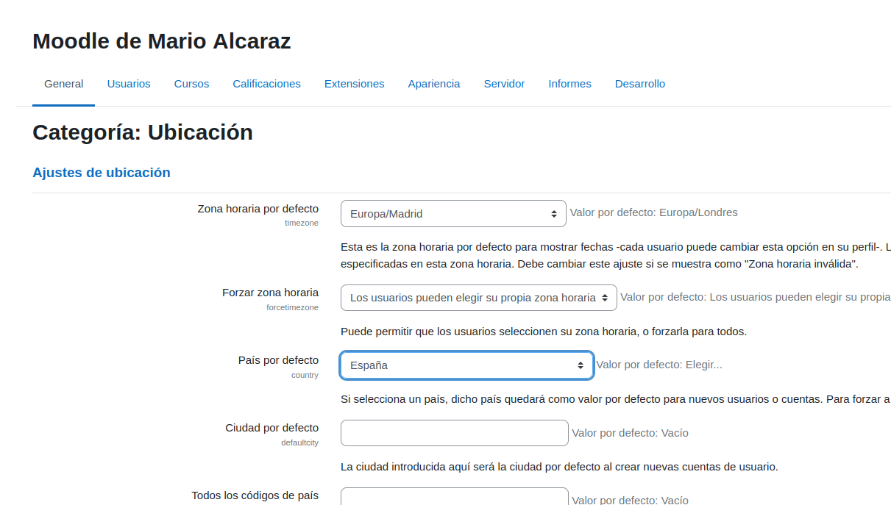

# Moodle
Desde hace unas semanas, he hecho un Moodle a través de una maquina virtual de Linux, a continuación os explicaré todo lo que hice
## Configuración Inicial
Primero, tuve que crear mi cuenta y hacer las primeras configuraciones para poder entrar a Moodle, como el nombre de usuario, contraseña entre otros

Después de esto, tuve que ponerle un nombre a mi Moodle, tanto su nombre completo como el corto, y también algunos ajustes más, como el de la ubicación

## Configuración Principal
Después de eso, entré a Moodle, en donde lo primero que hice fue cambiarme la información del perfil, para ello fui a Perfil, Editar Perfil y la edité, cambié mi foto, mi contraseña y mi correo

Después de eso, cambié mi nombre del sitio e hice que la página principal no muestre nada por los usuarios que no estén autentificados, eso lo hice yendo a Administración del sitio y a Pagina principal del sitio, para lo segundo fui a Elemntos de la pagina principal del sitio al Iniciar sesion y puse ninguno.

Luego, quise comprobar que la hora del Moodle es la correcta, para ello fui a Administración del sitio, Ubicación y a Zona horaria por defecto

